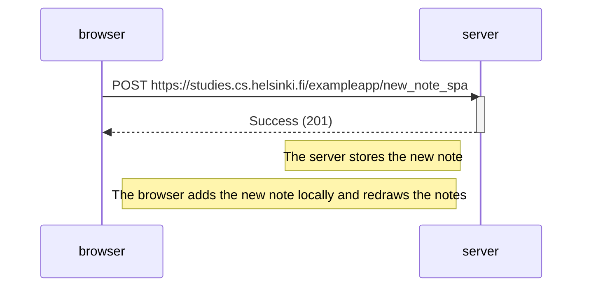

Creating a new note on the single-page app on https://studies.cs.helsinki.fi/exampleapp/spa

```mermaid
sequenceDiagram
    participant browser
    participant server

    browser->>server: POST https://studies.cs.helsinki.fi/exampleapp/new_note_spa
    activate server
    server-->>browser: Success (201)
    deactivate server

    Note left of server: The server stores the new note

    Note right of browser: The browser adds the new note locally and redraws the notes
```
